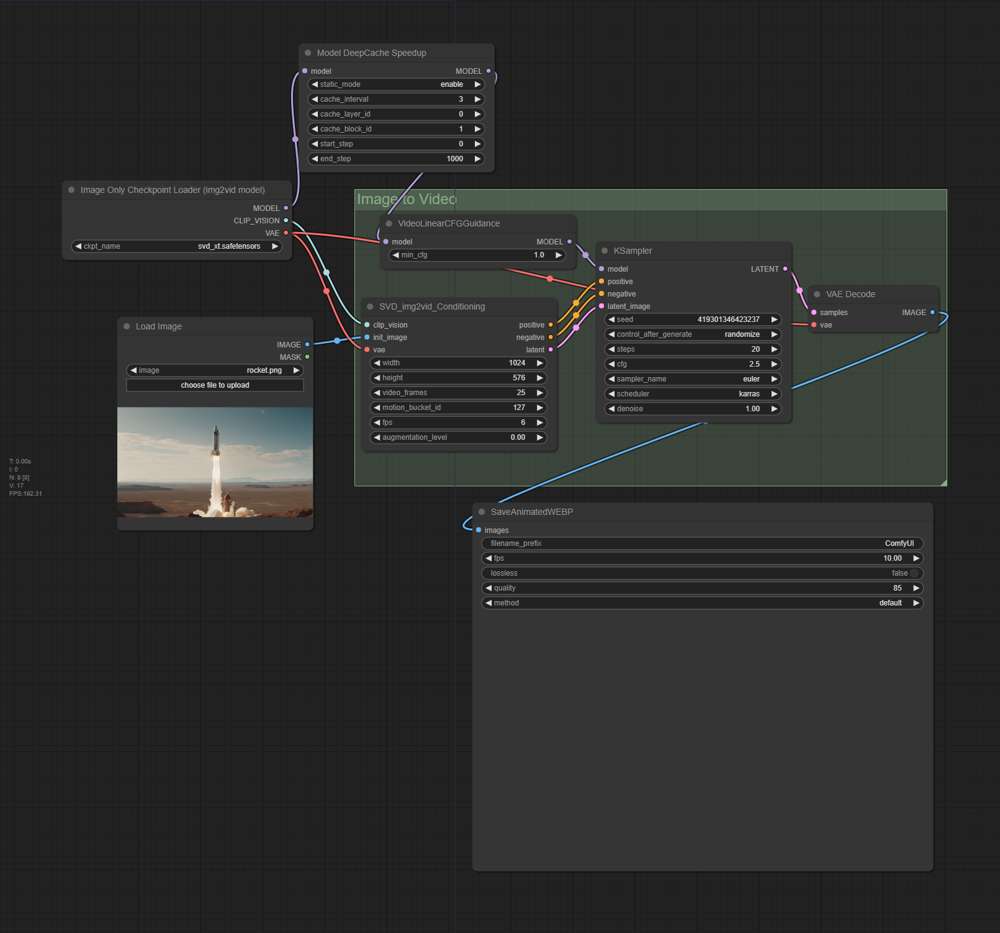

# OneDiff ComfyUI Nodes

- [OneDiff ComfyUI Nodes](#onediff-comfyui-nodes)
  - [Performance of Community Edition](#performance-of-community-edition)
  - [Installation Guide](#installation-guide)
  - [Nodes Usage](#nodes-usage)
    - [Model Acceleration](#model-acceleration)
      - [Model Speedup](#model-speedup)
      - [Model Graph Saver](#model-graph-saver)
      - [Model Graph Loader](#model-graph-loader)
    - [Quantization](#quantization)
    - [VAE Acceleration](#vae-acceleration)
    - [SVD Acceleration](#svd-acceleration)
    - [Image Distinction Scanner](#image-distinction-scanner)


## Performance of Community Edition 
Updated on DEC 7, 2023. Device: RTX 3090

| SDXL1.0-base (1024x1024)                         | torch(Baseline) | onediff(Optimized) | Percentage improvement |
|--------------------------------------------------|-----------------|--------------------|------------------------|
| [Stable Diffusion workflow(UNet)](workflows/model-speedup.png)    | 4.08it/s        | 6.13it/s           | 50.25%                 |
| [LoRA workflow](workflows/mode-speedup-lora.png) | 4.05it/s        | 6.14it/s           | 51.60%                 |


## Installation Guide

1. Install and set up [ComfyUI](https://github.com/comfyanonymous/ComfyUI)


2. Install PyTorch and OneFlow

Install PyTorch:

```bash
pip install torch torchvision torchaudio
```

Install OneFlow Community(CUDA 11.x)

```bash
pip install --pre oneflow -f https://oneflow-pro.oss-cn-beijing.aliyuncs.com/branch/community/cu118
```

Install OneFlow Community(CUDA 12.x)

```bash
pip install --pre oneflow -f https://oneflow-pro.oss-cn-beijing.aliyuncs.com/branch/community/cu121
```

3. Intall onediff

```bash
https://github.com/Oneflow-Inc/onediff.git
cd onediff && pip install -e .
```

5. Install onediff_comfy_nodes for ComfyUI

```bash
cd onediff
cp -r onediff_comfy_nodes path/to/ComfyUI/custom_nodes/
```

6. (Optional) Enterprise Level Support

If you need Enterprise Level Support for your system or business, please refer to [OneDiff Enterprise Edition](https://github.com/Oneflow-Inc/onediff/blob/main/README.md#onediff-enterprise-edition) .


## Nodes Usage

**Note** All the images in this section can be loaded directly into ComfyUI. 

- OneDiff Community Nodes                    
  * [Model Speedup](workflows/model-speedup.png)
  * [Lora Speedup](workflows/mode-speedup-lora.png)
  * [ControlNet Speedup](workflows/model-speedup-controlnet.png)
  * [Module DeepCache SpeedUp on SD](workflows/deep-cache.png)
  * [Module DeepCache SpeedUp on SVD](workflows/svd-deepcache.png)
  * [SVD Speedup](workflows/text-to-video-speedup.png)
  * [Model Graph Saver](workflows/model-graph-saver.png)
  * [Model Graph Loader](workflows/model-graph-loader.png)
  * [Image Distinction Scanner](workflows/image-distinction-scanner.png)

- OneDiff Enterprise Nodes(Please refer to [OneDiff Enterprise Edition](https://github.com/Oneflow-Inc/onediff/blob/main/README.md#onediff-enterprise-edition) )
  * [Quantization](workflows/int8-speedup.png)
  * [Quantized Model Saver](workflows/int8-graph-saver.png)
  * [Quantized Model Loader](workflows/int8-graph-loader.png)
  


### Model Acceleration

#### Model Speedup

The "Model Speedup" node takes a model as input and outputs an optimized model.

If the `static_mode` is `enabled` (which is the default), it will take some time to compile before the first inference.

If `static_model` is `disabled`, there is no need for additional compilation time before the first inference, but the inference speed will be slower compared to `enabled`, albeit slightly.


#### Model Graph Saver

The optimized model from the "Model Speedup" node can be saved to "graph" by the "Model Graph Saver" node, allowing it to be used in other scenarios without the need for recompilation.


You can set different file name prefixes for different types of models.

#### Model Graph Loader

The "Model Graph Loader" node is used to load graph files from the disk, thus saving the time required for the initial compilation.


### Quantization

**Note: Quantization feature is only supported in OneDiff Enterprise.**

The "UNet Loader Int8" node is used to load quantized models. Quantized models need to be used in conjunction with the "Model Speedup" node.


The compilation result of the quantized model can also be saved as a graph and loaded when needed.

 


### VAE Acceleration

The VAE nodes used for accelerating, saving, and loading VAE graphs operate in a manner very similar to the usage of Model nodes.

Omitting specific details here, the following workflow can be loaded and tested.

**VAE Speedup and Graph Saver**


**VAE Speedup and Graph Loader**


### SVD Acceleration

Similar to the usage of "Model Speedup" nodes, it's used to accelerate the Stable Video Diffusion (SVD) model, completing the acceleration of the text-to-video pipeline.

Compatible with "Model Graph Loader" node and "Model Graph Saver" node.

Omitting specific details here, the following workflow can be loaded and tested.


### SVD Acceleration with DeepCache

This node can further accelerate onediff's SVD using [DeepCache](https://arxiv.org/abs/2312.00858).

Omitting specific details here, the following workflow can be loaded and tested.




### Image Distinction Scanner

The "Image Distinction Scanner" node is used to compare the differences between two images and visualize the resulting variances.


