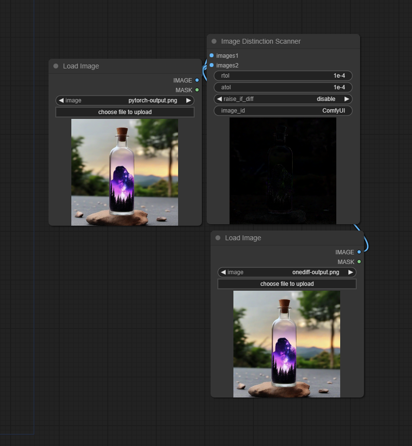

# OneDiff ComfyUI Nodes

- [Installation Guide](#installation-guide)
- [Nodes Usage](#nodes-usage)
  - [Model Acceleration](#model-acceleration)
    - [Model Speedup](#model-speedup)
    - [Model Graph Saver](#model-graph-saver)
    - [Model Graph Loader](#model-graph-loader)
  - [Quantization](#quantization)
  - [VAE Acceleration](#vae-acceleration)
  - [Image Distinction Scanner](#image-distinction-scanner)


## Installation Guide

1. Install and set up ComfyUI based on [this commit snapshot](https://github.com/comfyanonymous/ComfyUI/tree/aeba1cc2a068ba66b2701bf2aaba21a6364337bf)


2. Install PyTorch and OneFlow

```bash
pip install torch torchvision torchaudio && \
pip install --pre oneflow -f https://oneflow-pro.oss-cn-beijing.aliyuncs.com/branch/community/cu118
```

3. Intall onediff

```bash
git clone git@github.com:Oneflow-Inc/onediff.git
cd diffusers && pip install -e .
```

5. Install onediff_comfy_nodes for ComfyUI

```bash
cp -r onediff_comfy_nodes path/to/ComfyUI/custom_nodes/
```

6. (Optional) If int8 model is needed, install diffusers-quant

```bash
git clone git@github.com:siliconflow/diffusers-quant.git
export PYTHONPATH=$PYTHONPATH:`pwd`/diffusers-quant 
```


## Nodes Usage

**Note** All the images in this section can be loaded directly into ComfyUI.

### Model Acceleration

#### Model Speedup

The "Model Speedup" node takes a model as input and outputs an optimized model.

If the `static_mode` is `enabled` (which is the default), it will take some time to compile before the first inference.

If `static_model` is `disabled`, there is no need for additional compilation time before the first inference, but the inference speed will be slower compared to `enabled`, albeit slightly.


#### Model Graph Saver

The optimized model from the "Model Speedup" node can be saved to "graph" by the "Model Graph Saver" node, allowing it to be used in other scenarios without the need for recompilation.


You can set different file name prefixes for different types of models.

#### Model Graph Loader

The "Model Graph Loader" node is used to load graph files from the disk, thus saving the time required for the initial compilation.


### Quantization

The "UNet Loader Int8" node is used to load quantized models. Quantized models need to be used in conjunction with the "Model Speedup" node.


The compilation result of the quantized model can also be saved as a graph and loaded when needed.

 


### VAE Acceleration

The VAE nodes used for accelerating, saving, and loading VAE graphs operate in a manner very similar to the usage of Model nodes.

Omitting specific details here, the following workflow can be loaded and tested.

**VAE Speedup and Graph Saver**


**VAE Speedup and Graph Loader**


### Image Distinction Scanner

The "Image Distinction Scanner" node is used to compare the differences between two images and visualize the resulting variances.




